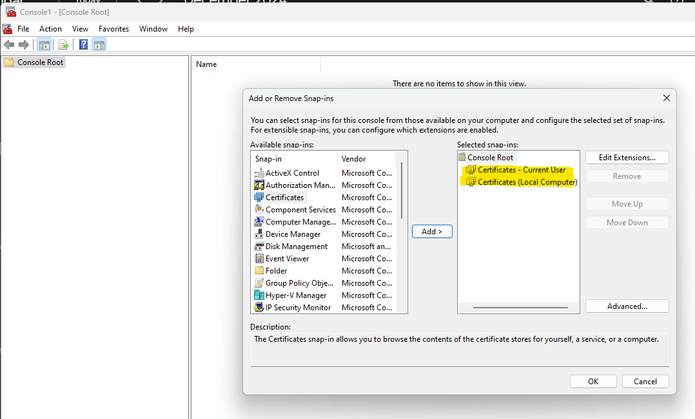

# PowerShell Cert Gen
Function to create a root CA and child certificates for SSL Cert

> [!NOTE] 
This can be done using LetEncrypt but using a custom CA is less hastle trying to get a cert to a machine that isn't using the letsencrypt process to install a cert.
This doesn't have to run on the same machine as it is deploying to

## Copy and Modify extension files
### 1) Extensions\RootCA\Root_CA.ext
	
```
[ req ]
prompt				= no
default_bits        = 2048 
default_keyfile     = <My-You-Need-To-Create-This-Cert-File>.pem
distinguished_name  = req_distinguished_name
emailAddress        = <cert_admin@example.com>
req_extensions		= v3_req
x509_extensions		= v3_ca

[req_distinguished_name]
C = US 

O =  Example
0.OU= default

CN= Example CA

[v3_req]
basicConstraints	= CA:TRUE
keyUsage		= digitalSignature, nonRepudiation, keyEncipherment,dataEncipherment,keyAgreement, keyCertSign, cRLSign

[v3_ca]
subjectKeyIdentifier   = hash
authorityKeyIdentifier = keyid:always,issuer:always
subjectAltName         = email:<cert_admin@example.com>
issuerAltName          = issuer:copy
```

### 2) Extensions\Server\server.example.com.ext
#### Use the server's FQDN in place of server.example.com
*Found in CN and DNS.1 & DNS.2*
```
[req]
prompt                 = no
days                   = 365
distinguished_name     = req_distinguished_name
req_extensions         = v3_req


[req_distinguished_name]
C = [Press Enter to Continue]
C_default 			   = US
C_min 				   = 2
C_max				   = 2

O = [0]
O_default    		   = Justin Time Concept Pathfinders

OU = [OU]
OU_default 			   = Crayons for Chow

ST = [ST]
ST_default 			   = GA

L = [L]
L_default 			   = Canton, GA		

CN = [CN]
CN_default = server.example.com

[v3_req]
basicConstraints       = CA:false
keyUsage			   = digitalSignature, nonRepudiation, keyEncipherment,dataEncipherment,keyAgreement, keyCertSign, cRLSign
extendedKeyUsage       = serverAuth,codeSigning,timeStamping
subjectAltName         = @altName

[altName]
DNS.0 = localhost
DNS.1 = server
DNS.2 = server.example.com
```

## Create a New CA
```
New-RootCA -RootCAPath "N:\test\certs" -RootCAName "Root_CA" -ValidDays 3653 -KeyPassword "password123!@#"
```

## Create certificates for Server
```
New-CertificateSet -RootCAPath "N:\test\certs" -RootCAName "Root_CA" -CertificatePath "N:\test\certs\server" -CertificateName "server.example.com" -ValidDays 3653 -KeyPassword "password123!@#"
```

## Import new CA to the local machine
### 1) Add certificate tabs


### 2) Import Root Certificate

> [!IMPORTANT]
> Perform for both CurrentUser and LocalMachine


### 3) Click yes to install


### 4) Verify Install


## Import New server cert with Private key

### 1) Install Private Key


### Verify Installed Cert is valid with Custom CA


